# FinTrack — Quản lý Tài chính Cá nhân Local-First

[](https://github.com/haitranduc203/Personal-Finance)


**FinTrack** là ứng dụng Android Native quản lý tài chính cá nhân theo hướng **local-first**, tập trung vào tốc độ phản hồi và trải nghiệm hiện đại với Jetpack Compose và Material 3. Dữ liệu tài chính và cài đặt được lưu cục bộ bằng Room Database và Jetpack DataStore, không phụ thuộc vào máy chủ ứng dụng. Android cloud backup và device-to-device transfer được vô hiệu hóa thông qua manifest cùng các quy tắc backup/data extraction.

---

## Mục lục
1. [Điểm nổi bật](#-điểm-nổi-bật)
2. [Bộ sưu tập Ảnh chụp thực tế](#-bộ-sưu-tập-ảnh-chụp-thực-tế)
3. [Chi tiết Tính năng](#-chi-tiết-tính-năng)
4. [Kiến trúc & Luồng dữ liệu](#-kiến-trúc--luồng-dữ-liệu)
5. [Cấu trúc Thư mục](#-cấu-trúc-thư-mục)
6. [Công nghệ & Thư viện](#-công-nghệ--thư-viện)
7. [Kiểm thử Đơn vị (Unit Testing)](#-kiểm-thử-đơn-vị-unit-testing)
8. [Hướng dẫn Cài đặt & Chạy](#-hướng-dẫn-cài-đặt--chạy)

---

## 🌟 Điểm nổi bật

- **Local-First Storage**: Dữ liệu tài chính và cài đặt được lưu cục bộ bằng Room Database và Jetpack DataStore, cho phép các chức năng chính hoạt động offline. Android cloud backup và device-to-device transfer được vô hiệu hóa bằng cấu hình manifest cùng các quy tắc backup/data extraction.
- **100% Jetpack Compose & Material 3**: Giao diện thuần khai báo (Declarative UI), hỗ trợ Edge-to-Edge chuẩn Android 15, Dark Theme tự nhiên và chuyển động vi mô (micro-interactions) mượt mà.
- **Nhập liệu số tiền thông minh**: Bộ lọc trực quan phân tách hàng nghìn bằng dấu chấm (`5.000.000 ₫`), tự động ẩn placeholder khi nhập và căn chỉnh vị trí con trỏ chính xác.
- **Thẻ Insight Xu hướng Tài chính Động**: Tự động phân tích tỷ lệ giữ lại thu nhập theo thời gian thực dựa trên tổng thu chi thực tế trong tháng.
- **Bộ điều hướng & Lọc kỳ thời gian linh hoạt**: Hỗ trợ chuyển đổi nhanh giữa các tháng `< Tháng 8, 2026 >`, lọc Hôm nay, Tuần, Tháng, Năm, Toàn thời gian và khoảng ngày tùy chọn.
- **Biểu đồ Thống kê Canvas Chuyên nghiệp**: Donut Chart phân tích cơ cấu chi tiêu theo danh mục và Grouped Bar Chart so sánh đối ứng Thu vs Chi theo từng mốc thời gian.
- **Tác vụ ngầm & Thông báo định kỳ (WorkManager)**: Lập lịch nhắc nhở ghi chép hàng ngày bền bỉ, sống sót qua khởi động lại máy mà không gây tốn pin.
- **Độ tin cậy cao**: Bộ **55 bài kiểm thử đơn vị (Unit Tests)** độc lập kiểm tra Repositories, ViewModels, Converters, Formatters và Visual Transformations.

---

## 📸 Bộ sưu tập Ảnh chụp thực tế

Toàn bộ hình ảnh dưới đây được chụp trực tiếp từ thiết bị Android thật đang chạy ứng dụng FinTrack:

### 1. Khởi động & Màn hình Chào mừng (Onboarding)
<p align="center">
  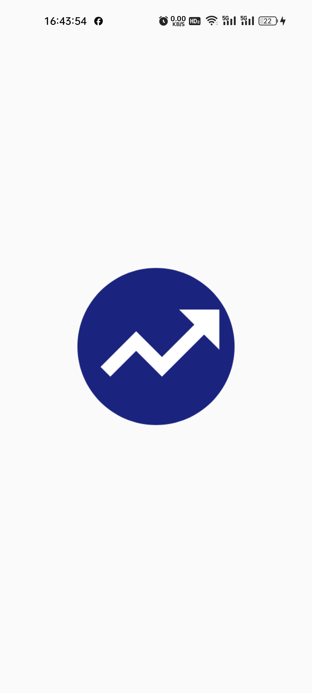
  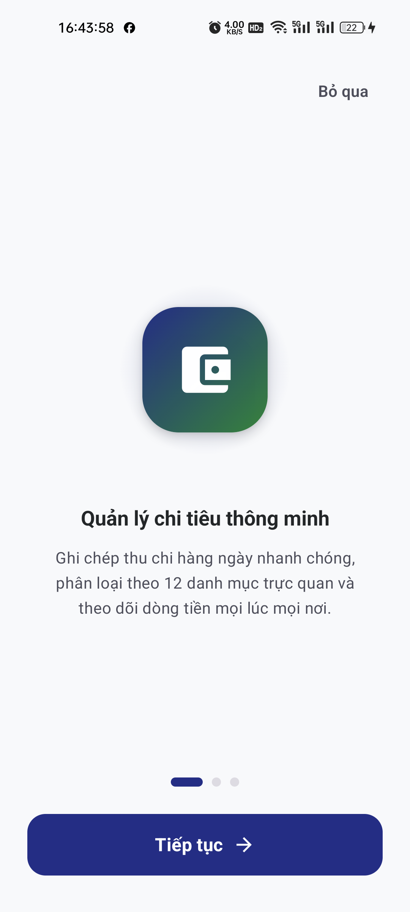
  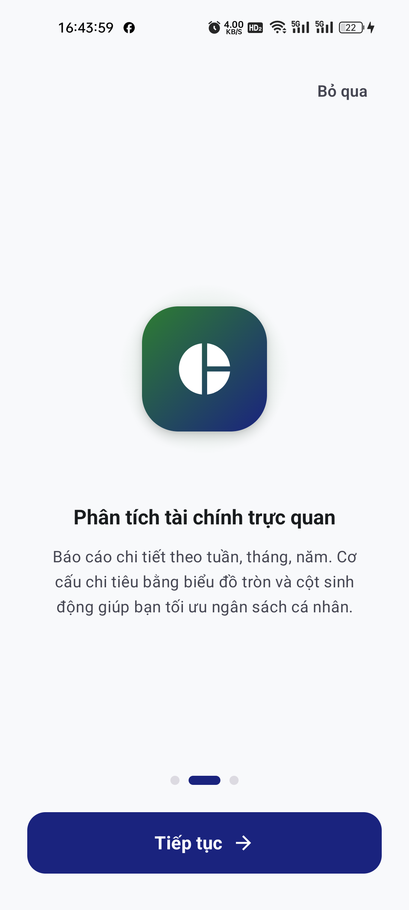
  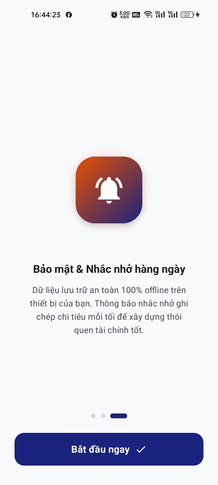
</p>

### 2. Trang chủ & Dashboard dòng tiền (Light & Dark Theme)
<p align="center">
  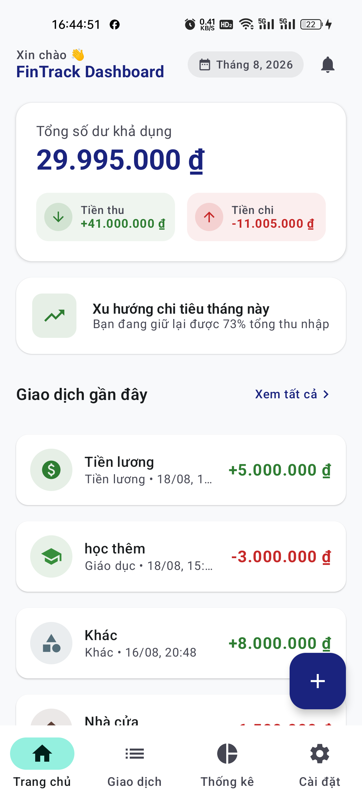
  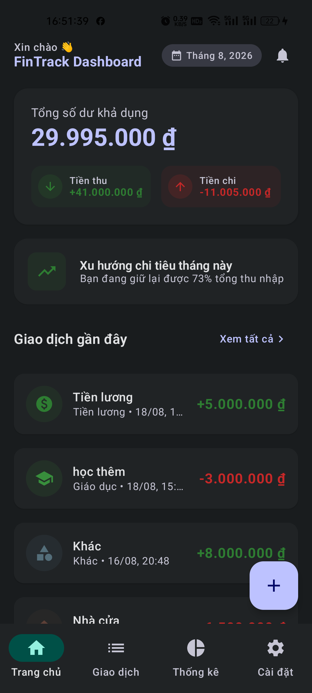
</p>

### 3. Thêm / Chỉnh sửa Giao dịch & Định dạng số tiền
<p align="center">
  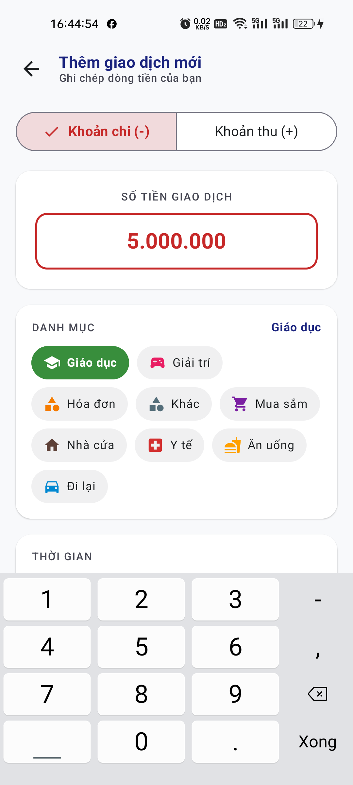
  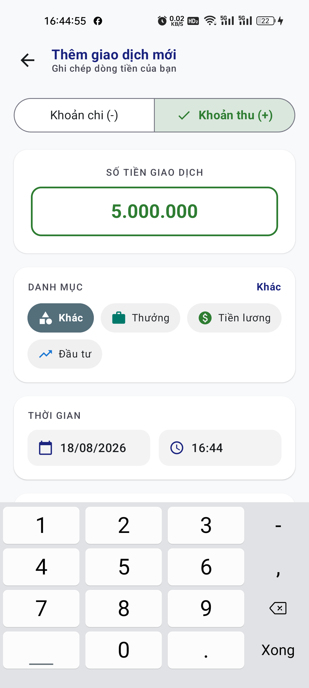
  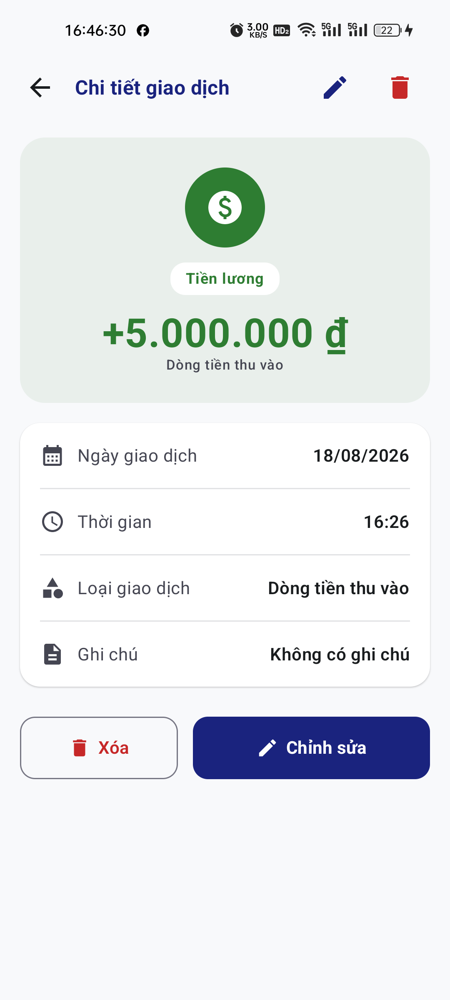
</p>

### 4. Sổ giao dịch, Bộ điều hướng kỳ & Tìm kiếm
<p align="center">
  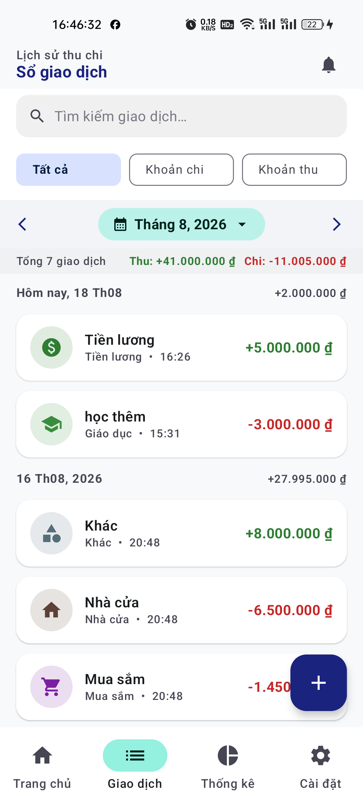
  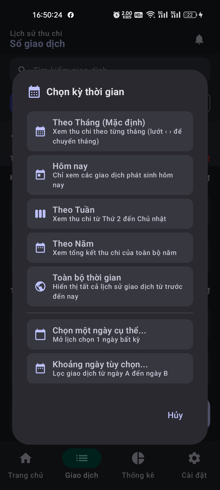
  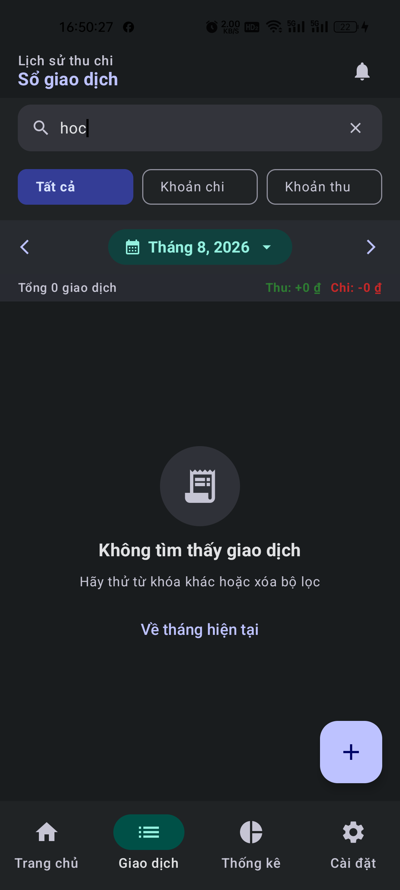
</p>

### 5. Báo cáo & Thống kê Tài chính trực quan
<p align="center">
  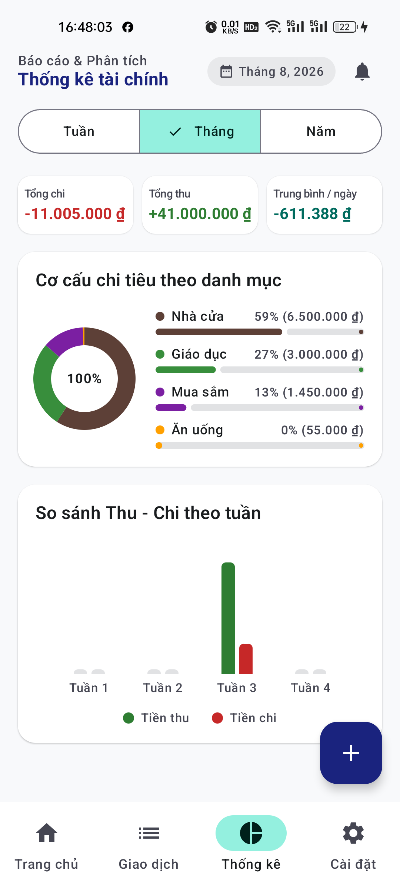
  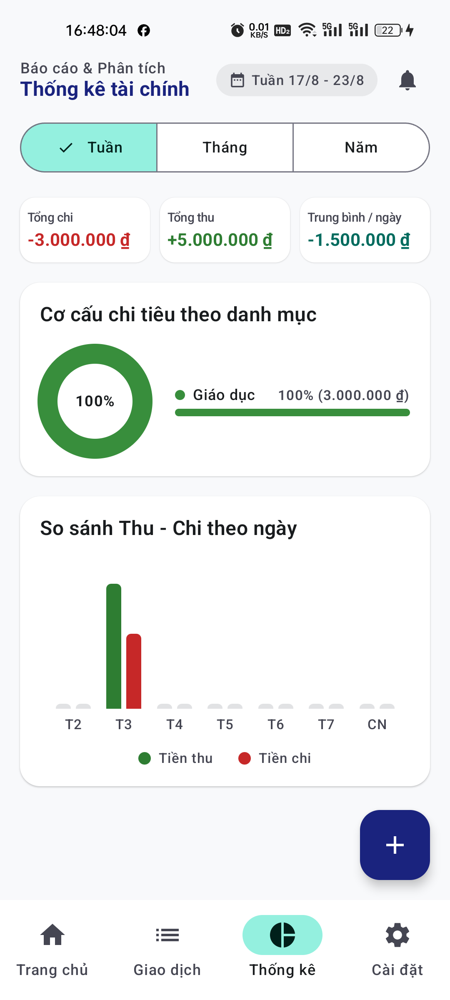
  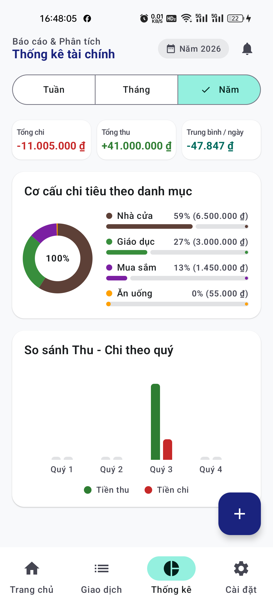
</p>

### 6. Cài đặt Hệ thống, Bảo mật & Thông báo
<p align="center">
  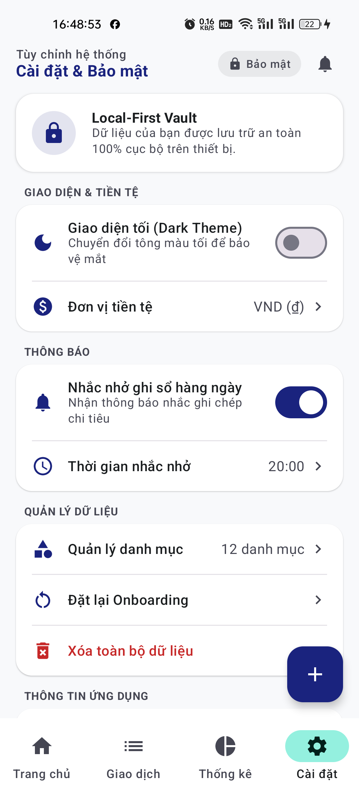
  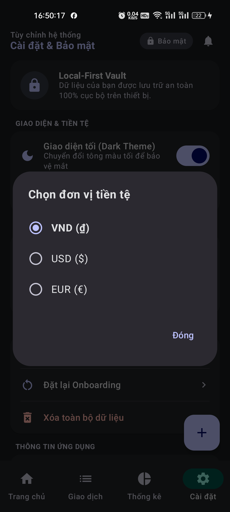
  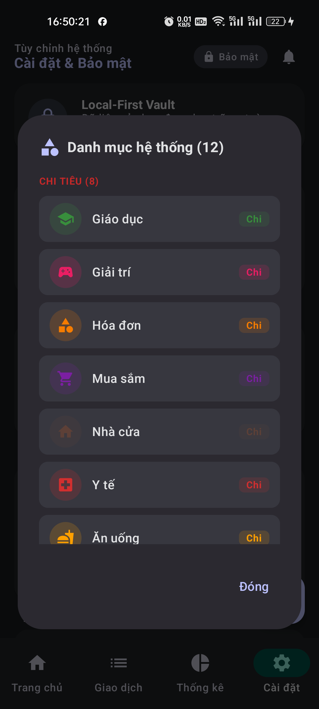
  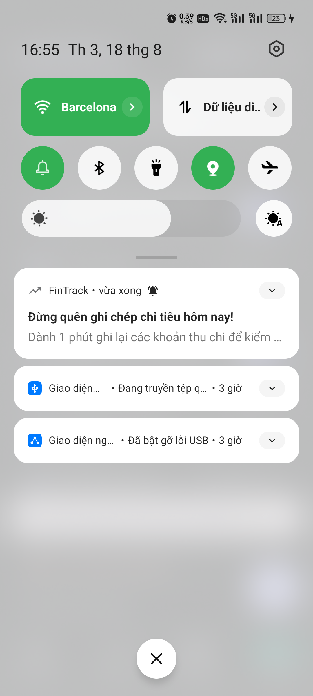
</p>

---

## 🎯 Chi tiết Tính năng

### 1. Trải nghiệm Khởi đầu (Onboarding & Splash)
- Màn hình Splash nhận diện thương hiệu với hiệu ứng chuyển trang mượt mà.
- Trình hướng dẫn 3 bước giới thiệu các tính năng cốt lõi: Quản lý chi tiêu, Phân tích trực quan và Bảo mật Local-First.
- Trạng thái hoàn thành được lưu vào DataStore, hỗ trợ đặt lại (Reset Onboarding) trong Cài đặt.

### 2. Tổng quan Dashboard Tài chính (Home)
- **Thẻ Số dư Tổng thể**: Hiển thị tổng số dư khả dụng, tổng tiền thu (+) và tổng tiền chi (-) trong tháng.
- **Thẻ Xu hướng Tài chính Động**: Tự động tính tỷ lệ tiết kiệm/giữ lại thu nhập thực tế. Nếu chi tiêu vượt thu nhập, thẻ tự chuyển sang cảnh báo thâm hụt.
- **Danh sách Giao dịch Gần nhất**: Xem nhanh các giao dịch mới nhất kèm nút "Xem tất cả" điều hướng sang Sổ giao dịch.

### 3. Ghi chép Thu / Chi & Chi tiết Giao dịch (CRUD)
- **Chuyển đổi loại giao dịch**: Nút chuyển đổi nhanh giữa `Khoản chi (-)` và `Khoản thu (+)`.
- **Định dạng số tiền tự động**: Ứng dụng `ThousandsSeparatorVisualTransformation` tự động định dạng phân tách dấu chấm (ví dụ: `5.000.000 ₫`), tự ẩn số 0 placeholder khi focus để con trỏ không bị đè.
- **Phân loại danh mục trực quan**: Chọn nhanh từ danh sách danh mục kèm icon màu sắc.
- **Chi tiết & Thao tác an toàn**: Xem lại đầy đủ ngày giờ, loại giao dịch, ghi chú, hỗ trợ Sửa hoặc Xóa có hộp thoại xác nhận.

### 4. Sổ Giao dịch & Bộ điều hướng Kỳ thời gian
- **Bộ điều hướng Tháng**: Dễ dàng duyệt lịch sử giữa các tháng qua cụm nút `< Tháng X, YYYY >`.
- **Hộp thoại Chọn kỳ linh hoạt**: Cho phép lọc theo Hôm nay, Theo Tuần, Theo Tháng, Theo Năm, Toàn bộ thời gian hoặc Khoảng ngày tùy chọn.
- **Tìm kiếm thời gian thực**: Lọc danh sách theo ghi chú hoặc tên danh mục tức thì.
- **Nhóm theo ngày**: Tự động gom nhóm giao dịch theo từng ngày kèm tổng tiền chênh lệch của ngày đó.

### 5. Phân tích & Thống kê Chuyên sâu (Charts)
- **Chỉ số KPIs**: Tổng chi, Tổng thu và chỉ số **Trung bình / ngày** được tính toán chính xác theo số ngày thực tế trong kỳ.
- **Donut Chart (Biểu đồ tròn cơ cấu)**: Vẽ bằng Jetpack Compose Canvas, hiển thị tỷ trọng phần trăm từng danh mục chi tiêu kèm thanh chỉ báo màu sắc.
- **Grouped Bar Chart (Biểu đồ cột so sánh)**: Hiển thị đối ứng song song giữa Thu nhập và Chi tiêu theo từng tuần/tháng.
- **Empty State thông minh**: Minh họa trực quan khi chưa có dữ liệu giao dịch trong kỳ đã chọn.

### 6. Cài đặt, Đa tiền tệ & Nhắc nhở (Settings)
- **Local-First Vault Banner**: Khẳng định cam kết bảo mật và quyền sở hữu dữ liệu cục bộ của người dùng.
- **Chuyển đổi Giao diện Tối (Dark Mode)**: Hỗ trợ chuyển đổi Theme tức thì không làm gián đoạn trạng thái ứng dụng.
- **Đa đơn vị tiền tệ**: Hỗ trợ chuẩn định dạng cho `VND (₫)`, `USD ($)`, `EUR (€)`.
- **Quản lý 12 Danh mục**: Xem đầy đủ 8 danh mục chi tiêu và 4 danh mục thu nhập chuẩn hệ thống.
- **Nhắc nhở ghi chép hàng ngày**: Cài đặt giờ nhận thông báo qua TimePicker, tự động lên lịch chạy nền qua WorkManager.
- **Quản trị dữ liệu**: Tùy chọn Đặt lại Onboarding hoặc Xóa toàn bộ dữ liệu (Clear All Data).

---

## 🏗 Kiến trúc & Luồng dữ liệu

FinTrack sử dụng mô hình **MVVM kết hợp Repository pattern** và Unidirectional Data Flow. Cấu trúc được giữ gọn trong một app module để phù hợp phạm vi portfolio Android Fresher:

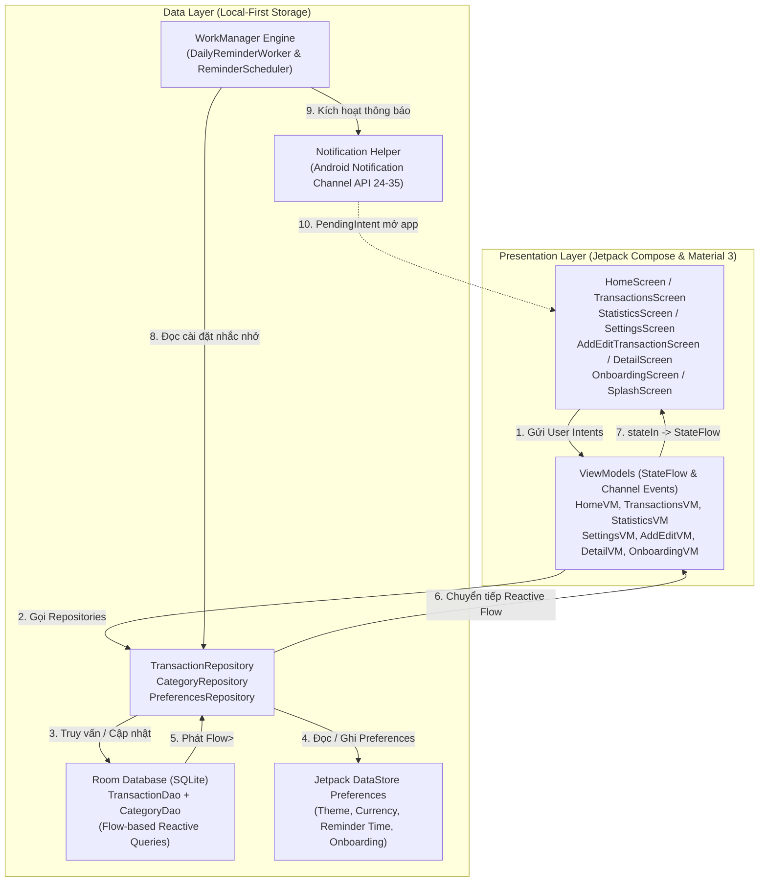

### Nguyên tắc thiết kế cốt lõi:
1. **Unidirectional Data Flow (UDF)**: Trạng thái (State) đi xuống giao diện, sự kiện (Events) đi lên ViewModel.
2. **Single Source of Truth (SSOT)**: Room Database và DataStore là nguồn dữ liệu duy nhất đáng tin cậy. UI chỉ quan sát luồng `Flow` phát ra từ Database.
3. **State bất biến & xử lý bất đồng bộ**: UI state được biểu diễn bằng các `data class` và phát qua `StateFlow`; các thao tác bất đồng bộ được điều phối bằng Kotlin Coroutines và `viewModelScope`, trong khi Room/DataStore quản lý việc truy cập dữ liệu.

---

## 📁 Cấu trúc Thư mục

```text
FinTrack/
├── app/
│   ├── src/main/java/com/fintrack/app/
│   │   ├── FinTrackApplication.kt            # Application context & Service locator
│   │   ├── MainActivity.kt                   # Single Activity entry point & Permission handling
│   │   ├── data/
│   │   │   ├── local/
│   │   │   │   ├── AppDatabase.kt            # Room Database & TypeConverters definition
│   │   │   │   ├── DefaultCategories.kt      # Danh sách 12 danh mục mặc định
│   │   │   │   ├── converters/               # Room Type Converters (Date, Enum)
│   │   │   │   ├── dao/                      # TransactionDao, CategoryDao
│   │   │   │   ├── entity/                   # TransactionEntity, CategoryEntity
│   │   │   │   ├── model/                    # CategoryExpense, PeriodFilter, TransactionWithCategory
│   │   │   │   └── preferences/              # UserPreferences, Theme & Currency configs
│   │   │   ├── notification/                 # NotificationHelper & Channel configuration
│   │   │   └── repository/                   # TransactionRepository, CategoryRepository, PreferencesRepository
│   │   ├── ui/
│   │   │   ├── components/                   # Navigation (FinTrackApp), BottomNav, EmptyStateView
│   │   │   ├── navigation/                   # Screen destinations & Routes
│   │   │   ├── screens/
│   │   │   │   ├── add_edit/                 # AddEditTransactionScreen & ViewModel
│   │   │   │   ├── detail/                   # TransactionDetailScreen & ViewModel
│   │   │   │   ├── home/                     # HomeScreen & HomeViewModel
│   │   │   │   ├── onboarding/               # OnboardingScreen & OnboardingViewModel
│   │   │   │   ├── settings/                 # SettingsScreen, SettingsViewModel & Dialogs
│   │   │   │   ├── splash/                   # SplashScreen
│   │   │   │   ├── statistics/               # StatisticsScreen, ViewModel, DonutChart, BarChart
│   │   │   │   └── transactions/             # TransactionsScreen & TransactionsViewModel
│   │   │   ├── theme/                        # Theme, Color tokens, Type typography
│   │   │   ├── util/                         # CategoryIconHelper, CurrencyFormatter, DateTimeExtensions, ThousandsSeparatorVisualTransformation
│   │   │   └── viewmodel/                    # AppViewModelProvider Factory
│   │   └── worker/                           # DailyReminderWorker & ReminderScheduler
│   └── src/test/java/com/fintrack/app/       # Bộ 55 bài Unit Tests
├── screenshots/                              # Bộ ảnh chụp màn hình thực tế từ thiết bị
└── README.md                                 # Tài liệu kỹ thuật dự án
```

---

## 💻 Công nghệ & Thư viện

| Phân loại | Công nghệ / Thư viện | Phiên bản | Mô tả vai trò |
|---|---|---|---|
| **Core & Ngôn ngữ** | Kotlin | `2.3.20` | Ngôn ngữ phát triển chính |
| **Build System** | Android Gradle Plugin (AGP) | `9.0.1` | Hệ thống biên dịch hiện đại |
| **Java Compatibility** | JDK 17 & Core Library Desugaring | `desugar_jdk_libs:2.1.4` | Hỗ trợ `java.time` trên Android API 24+ |
| **UI Toolkit** | Jetpack Compose BOM | `2025.02.00` | Khung phát triển giao diện khai báo |
| **Design System** | Material 3 | `1.3.1` | Hệ thống thiết kế chuẩn Material Design 3 |
| **Điều hướng** | Navigation Compose | `2.8.8` | Quản lý chuyển màn hình và điều hướng |
| **Cơ sở dữ liệu** | Room Database (KSP) | `2.6.1` (KSP `2.3.6`) | Cơ sở dữ liệu SQLite cục bộ |
| **Lưu trữ Cài đặt** | Jetpack DataStore Preferences | `1.1.3` | Lưu cấu hình người dùng an toàn |
| **Tác vụ Nền** | AndroidX WorkManager | `2.10.0` | Lập lịch thông báo nhắc nhở định kỳ |
| **Bất đồng bộ** | Kotlin Coroutines & StateFlow | `1.10.1` | Xử lý đa luồng và reactive streams |
| **Kiểm thử Đơn vị** | JUnit 4 & Coroutines Test | `4.13.2` | Bộ 55 bài test kiểm thử logic |

---

## 🧪 Kiểm thử Đơn vị (Unit Testing)

Dự án trang bị bộ **55 bài kiểm thử đơn vị độc lập** kiểm tra repositories, ViewModels, converters, formatters và visual transformations:

| Nhóm Kiểm thử | Test Class | Số bài test | Trạng thái |
|---|---|:---:|:---:|
| **Converters** | `AppTypeConvertersTest` | 2 | ✅ 100% Passed |
| **Data Repositories** | `CategoryRepositoryTest`<br>`TransactionRepositoryTest` | 4<br>3 | ✅ 100% Passed<br>✅ 100% Passed |
| **Tiện ích & Formatters** | `CurrencyFormatterTest`<br>`DateTimeExtensionsTest`<br>`ThousandsSeparatorVisualTransformationTest` | 7<br>3<br>4 | ✅ 100% Passed<br>✅ 100% Passed<br>✅ 100% Passed |
| **ViewModels & UI State** | `AddEditTransactionViewModelTest`<br>`HomeViewModelTest`<br>`OnboardingViewModelTest`<br>`SettingsViewModelTest`<br>`StatisticsViewModelTest`<br>`TransactionDetailViewModelTest`<br>`TransactionsViewModelTest` | 6<br>3<br>1<br>8<br>3<br>4<br>7 | ✅ 100% Passed<br>✅ 100% Passed<br>✅ 100% Passed<br>✅ 100% Passed<br>✅ 100% Passed<br>✅ 100% Passed<br>✅ 100% Passed |
| **Tổng cộng** | **13 Test Classes** | **55 Tests** | **✅ 100% Passed (0 Failures)** |

Lệnh thực thi toàn bộ test suite:
```powershell
.\gradlew.bat testDebugUnitTest
```

---

## 🚀 Hướng dẫn Cài đặt & Chạy

### 1. Yêu cầu Môi trường
- **Android Studio**: Android Studio Ladybug (2024.2+) hoặc mới hơn.
- **JDK**: Java 17 trở lên.
- **Thiết bị / Giả lập**: Android API 24 (Android 7.0) trở lên (Khuyến nghị Android 13+ để trải nghiệm đầy đủ Notification Permission).

### 2. Tải mã nguồn
```bash
git clone https://github.com/haitranduc203/Personal-Finance.git
cd Personal-Finance
```

### 3. Biên dịch và Cài đặt lên thiết bị
Mở terminal trong thư mục dự án và chạy:

```powershell
# Chạy Unit Tests
.\gradlew.bat testDebugUnitTest

# Biên dịch gói APK Debug
.\gradlew.bat assembleDebug

# Cài đặt trực tiếp lên thiết bị đang kết nối
.\gradlew.bat installDebug
```

---

## 📄 Bản quyền & Tác giả

- **Tác giả**: [Trần Đức Hải](https://github.com/haitranduc203)
- **Dự án**: FinTrack — Personal Finance Management Android App
- **Giấy phép**: MIT License
