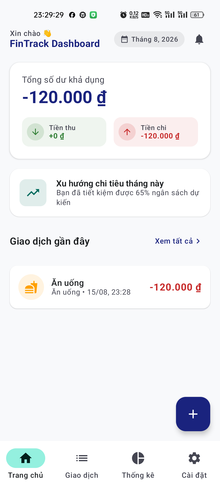
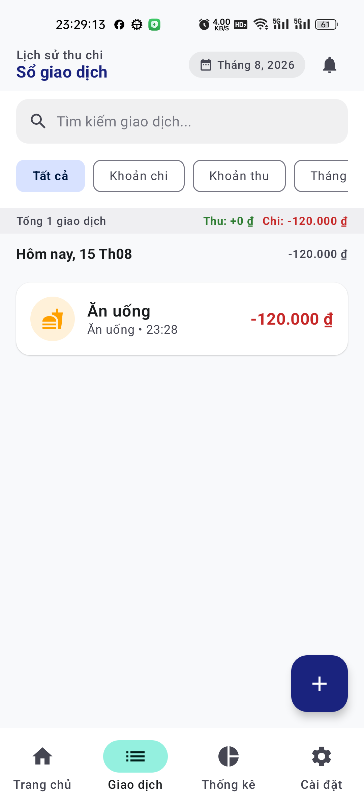
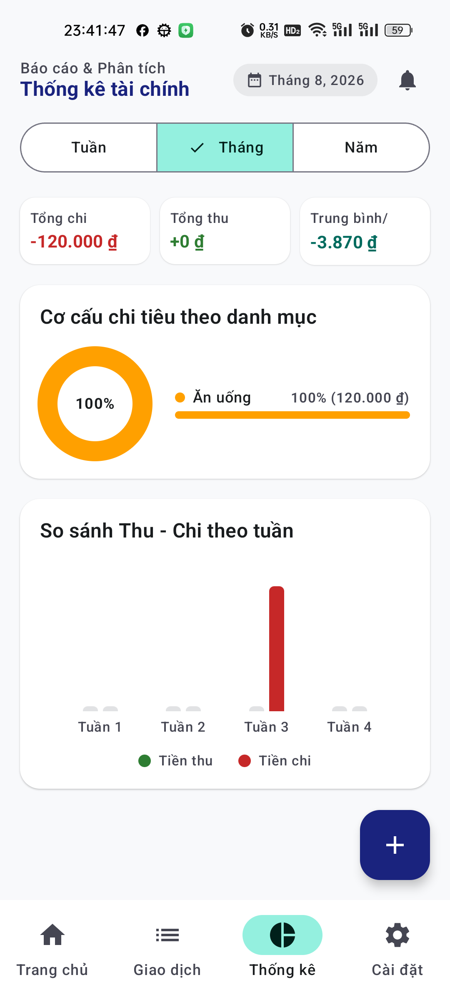
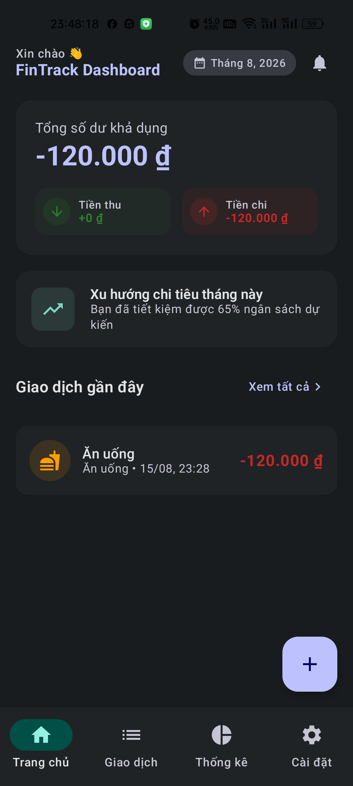
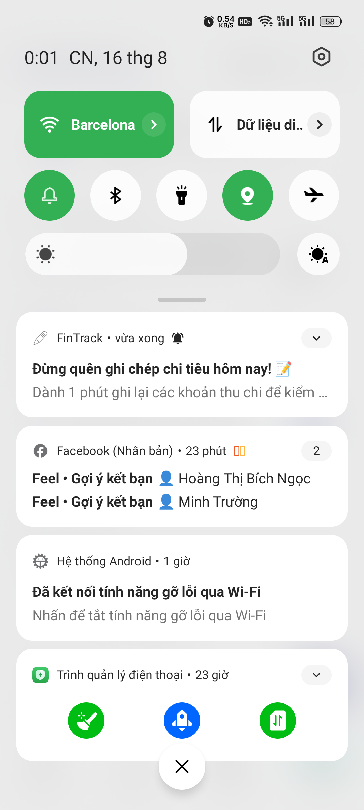
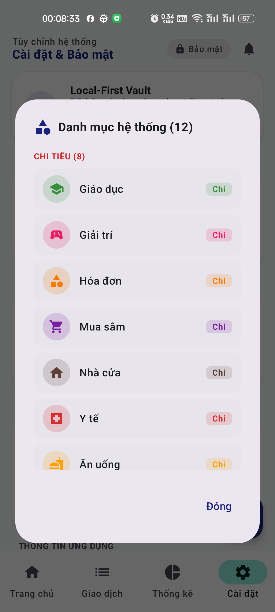
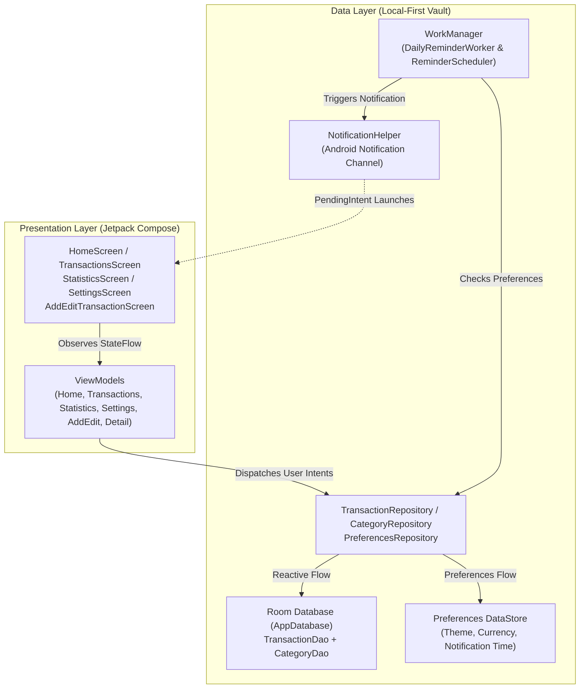

# FinTrack — Quản lý Tài chính Cá nhân Local-First

[](https://github.com/haitranduc203/Personal-Finance)


`FinTrack` là ứng dụng Android Native quản lý tài chính cá nhân được xây dựng theo kiến trúc **Local-First Vault** bảo mật tuyệt đối. Ứng dụng giúp người dùng ghi chép chi tiêu, theo dõi dòng tiền thu/chi tức thì, trực quan hóa dữ liệu qua biểu đồ tương tác và duy trì thói quen quản lý tài chính nhờ thông báo nhắc nhở định kỳ.

> **Trạng thái**: Production-ready Prototype / Android Fresher Showcase Portfolio. Dữ liệu được lưu trữ 100% cục bộ trên thiết bị của người dùng, không phụ thuộc máy chủ bên thứ ba.

---

## Điểm nổi bật

- **Kiến trúc Hiện đại**: MVVM kết hợp Unidirectional Data Flow (UDF), Kotlin Coroutines và StateFlow phản ứng thời gian thực (Reactive State).
- **100% Jetpack Compose & Material 3**: Giao diện thuần khai báo (Declarative UI), hỗ trợ Edge-to-Edge mượt mà và chuyển đổi Dark/Light Theme tức thì.
- **Local-First Database (Room)**: Room Database làm Local Source of Truth với quan hệ thực thể chặt chẽ (`CategoryEntity` $\leftrightarrow$ `TransactionEntity`), Indexing tối ưu truy vấn và Room Flow đồng bộ tự động.
- **Tùy biến Cài đặt linh hoạt (DataStore Preferences)**: Lưu trữ cài đặt giao diện (Dark Mode), đa đơn vị tiền tệ (`VND ₫`, `USD $`, `EUR €`), giờ nhắc nhở và trạng thái Onboarding.
- **Tác vụ nền & Thông báo định kỳ (WorkManager)**: `DailyReminderWorker` tự động lập lịch nhắc nhở 24h, tính toán thời gian trễ chính xác và kích hoạt thông báo qua Notification Channel ưu tiên cao trên Android 13+ (API 33+).
- **Biểu đồ Trực quan hóa Tương tác (Canvas Charts)**: Tự phát triển Donut Chart phân tích tỷ trọng danh mục kèm thẻ chú thích linh hoạt và Grouped Bar Chart so sánh Thu vs Chi theo Tuần/Tháng/Năm.
- **Chất lượng mã nguồn & Kiểm thử (Quality & Testing)**: Hoàn thành 100% bộ **34 bài kiểm thử đơn vị (Unit Tests)** độc lập bao phủ toàn bộ DAO, Repository và ViewModel logic.

---

## Giao diện ứng dụng

<p align="center">
  
  
  
</p>
<p align="center">
  
  
  
</p>

---

## Chức năng chính

### 1. Quản lý Thu — Chi & Dashboard dòng tiền (Home & CRUD)
- **Tổng quan Dashboard**: Hiển thị tổng số dư khả dụng, tổng tiền thu, tổng tiền chi và danh sách 5 giao dịch gần nhất.
- **Thêm/Sửa/Xóa Giao dịch**: Form nhập liệu thông minh với bàn phím số, chọn danh mục trực quan kèm mã màu, ghi chú, định dạng ngày giờ và xác nhận xóa an toàn.
- **Chống Submit đúp (Double Submit Prevention)**: Khóa nút lưu trong lúc xử lý và hiển thị Snackbar phản hồi mượt mà.

### 2. Tìm kiếm & Lọc giao dịch (Transactions)
- Tìm kiếm từ khóa theo ghi chú hoặc danh mục thời gian thực.
- Phân loại bộ lọc theo tab: **Tất cả**, **Chi tiêu**, **Thu nhập**.
- Nhóm giao dịch theo thời gian trong tháng.

### 3. Thống kê & Phân tích Chi tiêu (Statistics & Charts)
- Bộ lọc linh hoạt theo chu kỳ: **Tuần**, **Tháng**, **Năm**.
- **Donut Chart**: Trực quan hóa cơ cấu chi tiêu theo danh mục với tỷ lệ phần trăm và số tiền định dạng chuẩn xác.
- **Grouped Bar Chart**: So sánh trực quan đối ứng giữa dòng tiền Thu vào và Chi ra theo từng mốc thời gian.
- Xử lý trạng thái rỗng (Empty Chart State) khi chưa có dữ liệu phát sinh.

### 4. Tùy chỉnh Hệ thống & Bảo mật (Settings & Local Vault)
- Chuyển đổi Dark/Light Theme toàn ứng dụng phản ứng ngay lập tức.
- Lựa chọn đơn vị tiền tệ: `VND (₫)`, `USD ($)`, `EUR (€)`.
- Hộp thoại **Quản lý danh mục**: Hiển thị chi tiết 12 danh mục hệ thống (8 Chi tiêu, 3 Thu nhập, 1 Chung) kèm icon và color chip.
- Cài đặt thời gian nhận thông báo nhắc nhở ghi chép hàng ngày (TimePicker).
- Đặt lại Onboarding và Xóa sạch dữ liệu (Clear Data) an toàn.

### 5. Tác vụ Chạy ngầm & Thông báo (WorkManager & Notifications)
- Lập lịch định kỳ `PeriodicWorkRequest` 24 giờ một lần với `WorkManager`.
- Kênh thông báo `fintrack_daily_reminder` với độ ưu tiên cao (`IMPORTANCE_HIGH`), rung và hiển thị badge.
- Tự động điều hướng về màn hình chính khi người dùng nhấn vào thông báo.

---

## Kiến trúc hệ thống



### Luồng dữ liệu (Data Flow)
1. **Unidirectional Data Flow (UDF)**: UI bắn các sự kiện (Events/Intents) tới ViewModel $\rightarrow$ ViewModel gọi Repository $\rightarrow$ Repository cập nhật Room DAO hoặc DataStore.
2. **Reactive Flow**: Room Database phát ra `Flow<List<TransactionWithCategory>>` $\rightarrow$ Repository chuyển tiếp $\rightarrow$ ViewModel sử dụng `stateIn` biến đổi thành `StateFlow<UiState>` $\rightarrow$ Composable thu nạp qua `collectAsStateWithLifecycle()` và render lại giao diện mượt mà.
3. **Background Worker**: Khi tới giờ hẹn định kỳ, Android OS đánh thức `DailyReminderWorker` $\rightarrow$ kiểm tra DataStore $\rightarrow$ gửi thông báo nhắc người dùng ghi sổ nếu đang bật tính năng.

---

## Cấu trúc thư mục dự án

```text
FinTrack/
├── app/
│   ├── src/main/java/com/fintrack/app/
│   │   ├── FinTrackApplication.kt            # Application context & Service locator
│   │   ├── MainActivity.kt                   # Single Activity entry point & Permission handling
│   │   ├── data/
│   │   │   ├── local/
│   │   │   │   ├── AppDatabase.kt            # Room Database definition & TypeConverters
│   │   │   │   ├── DefaultCategories.kt      # 12 pre-seeded categories
│   │   │   │   ├── converters/               # Room Type Converters (Date, Enum)
│   │   │   │   ├── dao/                      # TransactionDao, CategoryDao
│   │   │   │   ├── entity/                   # TransactionEntity, CategoryEntity
│   │   │   │   ├── model/                    # CategoryExpense, PeriodFilter, TransactionWithCategory
│   │   │   │   └── preferences/              # UserPreferences, Theme & Currency enums
│   │   │   ├── notification/                 # NotificationHelper & Channel configuration
│   │   │   └── repository/                   # TransactionRepository, CategoryRepository, PreferencesRepository
│   │   ├── ui/
│   │   │   ├── components/                   # Navigation (FinTrackApp), BottomNav, EmptyStateView
│   │   │   ├── navigation/                   # Screen destinations & Routes
│   │   │   ├── screens/
│   │   │   │   ├── add_edit/                 # AddEditTransactionScreen & ViewModel
│   │   │   │   ├── detail/                   # TransactionDetailScreen & ViewModel
│   │   │   │   ├── home/                     # HomeScreen & HomeViewModel
│   │   │   │   ├── settings/                 # SettingsScreen, SettingsViewModel, Dialogs
│   │   │   │   ├── splash/                   # SplashScreen
│   │   │   │   ├── statistics/               # StatisticsScreen, ViewModel, DonutChart, BarChart
│   │   │   │   └── transactions/             # TransactionsScreen & TransactionsViewModel
│   │   │   ├── theme/                        # Theme, Color tokens, Type typography
│   │   │   ├── util/                         # CategoryIconHelper, Formatters
│   │   │   └── viewmodel/                    # AppViewModelProvider Factory
│   │   └── worker/                           # DailyReminderWorker & ReminderScheduler
│   └── src/test/java/com/fintrack/app/       # Full 34 Unit Tests Suite
├── screenshots/                              # Live device capture screenshots
└── README.md                                 # Portfolio Documentation
```

---

## Bảng công nghệ sử dụng

| Nhóm | Công nghệ / Thư viện | Phiên bản |
|---|---|---|
| **Language & Build** | Kotlin, Gradle Kotlin DSL, Java 17 | Kotlin `2.3.20`, AGP `9.0.1` |
| **UI Toolkit** | Jetpack Compose, Material 3, Navigation Compose | Compose BOM `2025.02.00`, M3 `1.3.1` |
| **Architecture** | MVVM, Unidirectional Data Flow, Coroutines, StateFlow | Coroutines `1.10.1` |
| **Local Database** | Room Database (Flow, DAO, Foreign Keys, Indexing) | Room `2.6.1` (KSP `2.3.6`) |
| **Preferences** | Jetpack DataStore Preferences | DataStore `1.1.3` |
| **Background Work** | WorkManager (PeriodicWorkRequest, CoroutineWorker) | WorkManager `2.10.0` |
| **Notifications** | Android Notification Manager, Notification Channel | API 26+ / API 33+ Compatible |
| **Unit Testing** | JUnit 4, Kotlinx Coroutines Test, Turbine | JUnit `4.13.2` |

---

## Kiểm thử & Chất lượng (Unit Testing)

Dự án chú trọng tính đúng đắn của logic tài chính với **34 bài unit test độc lập** đạt tỷ lệ thành công 100%:

```powershell
# Chạy toàn bộ Unit Test Suite
.\gradlew.bat testDebugUnitTest
```

```text
> Task :app:testDebugUnitTest
CategoryRepositoryTest > seedDefaultCategoriesIfEmpty_seedsWhenCountIsZero PASSED
CategoryRepositoryTest > observeCategoriesByType_filtersProperly PASSED
CategoryRepositoryTest > addAndGetCategory_worksCorrectly PASSED
CategoryRepositoryTest > deleteCategory_removesFromList PASSED
TransactionRepositoryTest > insertAndObserveTransactions PASSED
TransactionRepositoryTest > deleteTransaction_removesItem PASSED
TransactionRepositoryTest > getTransactionById_returnsCorrectItem PASSED
HomeViewModelTest > initialEmptyState_calculatesZeroBalances PASSED
HomeViewModelTest > withTransactions_calculatesMonthlyBalanceAndRecentList PASSED
TransactionsViewModelTest > filterBySearchQuery_filtersCorrectly PASSED
TransactionsViewModelTest > filterByType_filtersExpenseAndIncome PASSED
StatisticsViewModelTest > calculateCategoryExpenses_computesPercentagesAndTotals PASSED
StatisticsViewModelTest > calculateTrends_groupsIncomeAndExpenseByPeriod PASSED
AddEditTransactionViewModelTest > validation_failsWhenAmountIsZero PASSED
AddEditTransactionViewModelTest > saveTransaction_successFlow PASSED
TransactionDetailViewModelTest > loadTransaction_emitsState PASSED
TransactionDetailViewModelTest > deleteTransaction_invokesRepository PASSED
SettingsViewModelTest > toggleDarkTheme_updatesThemeState PASSED
SettingsViewModelTest > selectCurrency_updatesCurrencyState PASSED
SettingsViewModelTest > toggleReminderAndChangeTime_updatesState PASSED
SettingsViewModelTest > categoryDialog_opensAndDismisses PASSED
SettingsViewModelTest > resetOnboarding_updatesOnboardingCompletedState PASSED
...
BUILD SUCCESSFUL (34 tests passed)
```

---

## Hướng dẫn cài đặt & Chạy ứng dụng

### 1. Yêu cầu môi trường
- **Android Studio**: Android Studio Ladybug | 2024.2+ hoặc mới hơn.
- **JDK**: Java 17 trở lên.
- **Android SDK**: `compileSdk = 36`, `minSdk = 24` (Hỗ trợ từ Android 7.0 trở lên).

### 2. Clone Repository
```bash
git clone https://github.com/haitranduc203/Personal-Finance.git
cd Personal-Finance
```

### 3. Build & Cài đặt lên thiết bị
Mở terminal trong thư mục dự án và chạy:

**Windows PowerShell**:
```powershell
# Chạy kiểm thử đơn vị
.\gradlew.bat testDebugUnitTest

# Biên dịch gói APK Debug
.\gradlew.bat assembleDebug

# Cài đặt trực tiếp lên thiết bị (nếu đã kết nối ADB)
adb install -r app/build/outputs/apk/debug/app-debug.apk
```

**macOS / Linux**:
```bash
./gradlew testDebugUnitTest assembleDebug
adb install -r app/build/outputs/apk/debug/app-debug.apk
```

---

## Các quyết định kỹ thuật đáng chú ý (Technical Decisions)

| Vấn đề | Giải pháp triển khai | Lý do & Trade-off |
|---|---|---|
| **Bảo mật dữ liệu tài chính** | Kiến trúc **Local-First Vault** với Room Database | Người dùng có toàn quyền kiểm soát dữ liệu của mình, tốc độ tức thì, hoạt động 100% offline không lo rò rỉ dữ liệu. |
| **Phản ứng dữ liệu tức thì** | Sử dụng Room Flow kết hợp `StateFlow` trong ViewModel | UI luôn phản ánh trạng thái mới nhất ngay khi CRUD mà không cần gọi API refresh thủ công. |
| **Vẽ biểu đồ hiệu năng cao** | Tự thiết kế Canvas Donut & Bar Chart thuần Compose | Không phụ thuộc thư viện bên thứ 3 nặng nề, dễ tùy biến kích thước, màu sắc và animation theo Material 3. |
| **Nhắc nhở đúng giờ & tiết kiệm pin** | `WorkManager` với `PeriodicWorkRequest` 24h & Initial Delay | Đảm bảo hệ thống Android tự động tối ưu hóa pin (Doze mode) nhưng vẫn kích hoạt thông báo chính xác mỗi ngày. |
| **Quản lý Quyền Android 13+** | Khai báo `POST_NOTIFICATIONS` và kiểm tra runtime permission | Đảm bảo tuân thủ chính sách mới của Google Play và trải nghiệm người dùng liền mạch. |

---

## Tác giả

Phát triển bởi **Trần Đức Hải** ([@haitranduc203](https://github.com/haitranduc203))  
Mục đích: **Dự án Portfolio Android Fresher / Mobile Developer Showcase**.
